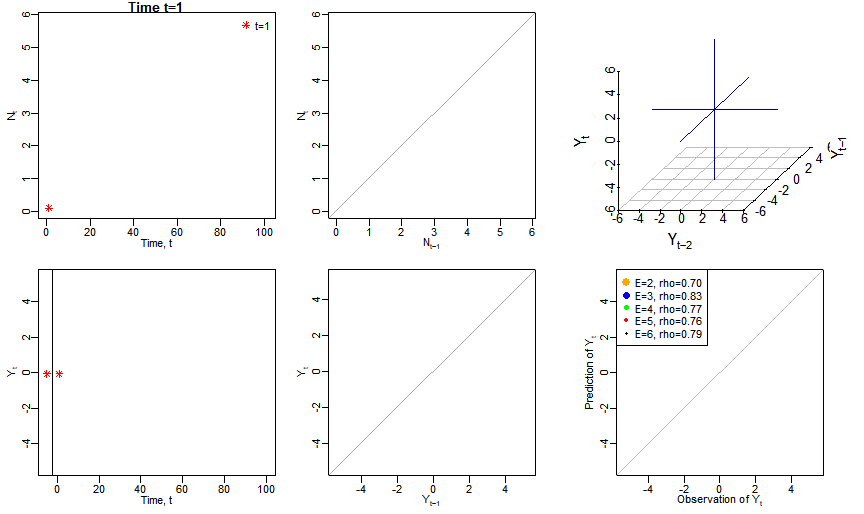

```{r, include = FALSE}
knitr::opts_chunk$set(
  collapse = TRUE,
  comment = "#>",
  fig.width = 6,
  fig.height = 6
)
```

```{r setup}
library(pbsEDM)
```

The tibble `Nx_lags_orig` is saved in the package and contains a simple time
series $N(t)$ as `Nt`, the lagged value $N(t-1)$ as `Ntmin1`, and first difference
$X(t) = N(t+1) - N(t)$ as `Xt` (and `Xtmin1` and `Xtmin2` the lagged values),
with EDM results for embedding dimension 2, using `rEDM` and Andy's original
function `EDM_pred_E_2()`. See `?Nx_lags_orig` for full details.

Using that as an example here, see `inclusion_issue.Rmd` vignette for comparison
of Andy's original results with results from `pbsEDM` and `rEDM`.

## Visualise data - can prob skip once new function done

Plot of data (before making movie):
```{r}
plotPanelMovie.df2(Nx_lags_orig,
                   only.final.plot=TRUE,
                   open.pdf=FALSE)
```

Movie -- see `inclusion_issue.Rmd` vignette.

The final panel shows the predicted vs observed from rEDM and from Andy's manual
calculations (not relevant here).

## Analyse with pbsEDM code

```{r pbsEDMcalc}
calc <- pbsEDM(Nx_lags_orig,
               lags = list(Xt = c(0:1))) # A list of results

# pred <- calc$xt_forecast

plot_observed(calc, late.num = 5)
```

```{r calc2}
# Use original Nt only, do lag of 1:
calc2 <- pbsEDM(Nx_lags_orig,
                lags = list(Nt = c(0:1)),
                first_difference = TRUE)

# plot_observed(calc2, late.num = 5)

testthat::expect_equal(calc$xt_forecast, calc2$xt_forecast)
```

Plot time series and cobweb plots

```{r cobweb}
plot(calc2)
```

Can also do a movie (see below, since it includes results also).

```{r, eval=FALSE, echo=FALSE}
# ```{r, animation.hook = 'gifski', interval = 1.5, fig.width = 5.36, fig.height = 8}
## fig.width is 0.67 * fig.height (which is 8)

for(iiii in 1:length(Nx_lags_orig$Nt)){
  plot(calc2,
       last.time.to.plot = iiii)
}
```

<!--
And again in landscape mode (for presentations):-->
```{r, eval=FALSE, echo=FALSE}
# ```{r, animation.hook = 'gifski', interval = 1.5, fig.width = 8, fig.height = 5.36}
for(iiii in 1:length(Nx_lags_orig$Nt)){
  plot(calc2,
       last.time.to.plot = iiii,
       portrait = FALSE)
}
```


## Make forecasts using different values of E

Using the simplex algorithm for different values of embedding dimension $E$
($E=2$ uses values $X_t$ and $X_{t-1}$).
```{r Eres}
E_results <- pbsEDM_Evec(Nx_lags_orig$Nt)
plot_pbsEDM_Evec(E_results)
```

And a movie of that (not run here as gifski causes Travis fails, see [here](https://htmlpreview.github.io/?https://raw.githubusercontent.com/andrew-edwards/sizeSpectra/master/doc/MEPS_IBTS_recommend.html) for an explanation):
<!-- # made width 9 not 8 to see axis labels better-->
```{r, eval=FALSE, echo=FALSE}
# ```{r, animation.hook = 'gifski', interval = 1.5, fig.width = 9, fig.height = 5.36}
for(iiii in 1:length(Nx_lags_orig$Nt)){
  plot_pbsEDM_Evec(E_results,
       last.time.to.plot = iiii,
       portrait = FALSE)
}
```

.

See how the forecast skill (correlation coefficient $\rho$) varies with $E$:
```{r rhoE}
plot_rho_Evec(E_results)
```

## Movie to demonstrate how EDM works

<!--
```{r, EDMmovie, animation.hook = 'gifski', interval = 5}
plot_explain_edm_movie(calc2,
                       tstar = 15)
```
-->
