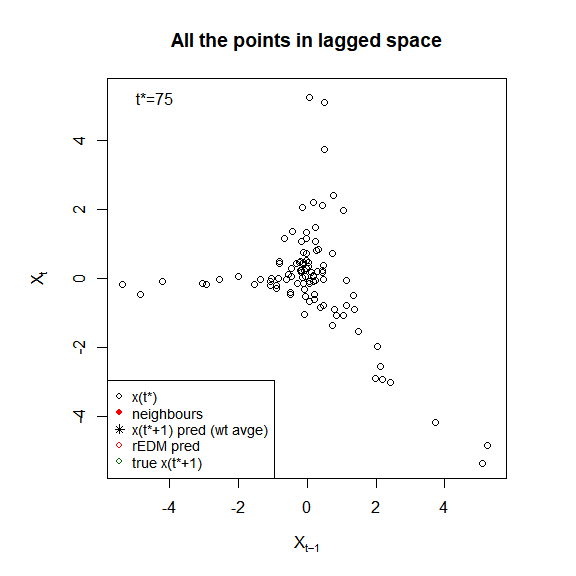

```{r start, include = FALSE}
knitr::opts_chunk$set(
  collapse = TRUE,
  comment = "#>",
  fig.width = 6,
  fig.height = 6
)
```

```{r setup}
library(pbsEDM)
```

NB: Andy to update notation with new notation; code runs though.

The tibble `NY_lags_example` is saved in the package and contains several columns,
though we are only going to use the original time series of simulated population numbers,
$N_t$, which has column name `N_t`. See `?NY_lags_example` for full details, and
the `inclusion_issue.Rmd` vignette for comparison our step-by-step calculations
with results from the functions in `pbsEDM` and `rEDM`.

<!-- , the lagged value $N(t-1)$ as `Ntmin1`, and first difference
$X(t) = N(t+1) - N(t)$ as `Xt` (and `Xtmin1` and `Xtmin2` the lagged
values). Also has results for embedding dimension 2, using both `rEDM` and Andy's original
function `EDM_pred_E_2()`.-->


## Analyse with pbsEDM code

Use only the `N_t` column from `NY_lags_example` and apply EDM
calculations using lags of 0 and 1 ($E = 2$) with first differencing:
```{r calc2}
calc2 <- pbsEDM(NY_lags_example,
                lags = list(N_t = c(0:1)),
                first_difference = TRUE)
```
This creates a `pbsEDM` object which is a list of results (see `?pbsEDM` for full details):
```{r res}
summary(calc2)
```
For now we'll just use that to plot the data in various useful ways:
```{r plotres, fig.width = 9, fig.height = 5.36}
plot(calc2,
     portrait = FALSE)
```
The figure shows, before doing EDM, the data in various ways: time series of $N_t$ and $Y_t$, plus phase plots of $N_t$ vs $N_{t-1}$, $Y_t$ vs $Y_{t-1}$ (as used for $E=2$) and $Y_t$ vs $Y_{t-1}$ vs $Y_{t-2}$ (as used for $E=3$). The last 3 values of $N_t$ are in red, with the final one as a star. In the $Y_t$ time series panel, the values of $Y_t$ are also plotted in a vertical line (to the left of $t=0$) which is the one-dimensional equivalent of a phase plot for $E=1$.

An animated movie (with EDM results) is shown later below; to create the movie
without the results use this code in an Rmarkdown document:
```{r datamovie, eval=FALSE, echo=TRUE}
{r, animation.hook = 'gifski', interval = 1.5, fig.width = 9, fig.height = 5.36}
## or for portrait use fig.width = 5.36, fig.height = 8
for(iiii in 1:length(NY_lags_example$N_t)){
  plot(calc2,
       last.time.to.plot = iiii,
       portrait = FALSE)
}
```

A lot of information is saved in the `calc2` list. See `?pbsEDM::pbsEDM`
for full details, but, for example, useful summary statistics are given by
```{r useful}
calc2$results
```
giving the embedding dimension $E$ (which is 2 here because we used lags of 0
and 1), forecast skill (correlation coefficient $\rho$) and root-mean-square
error between the observations and the predictions.

## Make forecasts using different values of E

Now use the simplex algorithm for different values of embedding dimension $E$,
where, for example $E=2$ uses first-difference values $Y_t$ and $Y_{t-1}$:
```{r Eres}
E_results <- pbsEDM_Evec(NY_lags_example$N_t)
```
The result is a list containing a `pbsEDM` object (as above) for each value of $E$, the
default being values $E = 2, 3, ..., 11$:
```{r Eresres}
summary(E_results)
```

There is a plotting function for the results, showing the data (as above) plus,
in the final panel, the predicted value of each data point and the $\rho$ for
each different value of $E$:
```{r Eresplot, fig.width = 9, fig.height = 5.36}
plot_pbsEDM_Evec(E_results,
                 portrait = FALSE)
```

A movie of that is run in an Rmarkdown file (uncomment the commented line) using:
```{r, eval=FALSE, echo=TRUE}
# ```{r movietime, animation.hook = 'gifski', interval = 1.5, fig.width = 9, fig.height = 5.36}
for(iiii in 1:length(NY_lags_example$N_t)){
  plot_pbsEDM_Evec(E_results,
       last.time.to.plot = iiii,
       portrait = FALSE)
}
```
.

(The version shown here is a saved version to post on GitHub to avoid Travis
issues -- see the text above the movie on
[this page](https://htmlpreview.github.io/?https://raw.githubusercontent.com/andrew-edwards/sizeSpectra/master/doc/MEPS_IBTS_recommend.html)
if you want an explanation why).

Now see how the forecast skill (correlation coefficient $\rho$) varies with $E$:
```{r rhoE}
plot_rho_Evec(E_results)
```

Each `E_results` component corresponds to a value of $E$, for example
```{r usefulE}
calc2$results
E_results[[1]]$results
E_results[[2]]$results
E_results[[3]]$results
```

The conclusion from the figure would be that $E = 3$ gives the highest value of
$\rho$, and so is best used for predictions.

## Movie to demonstrate how EDM works

Understanding of how EDM works can be enhanced with a specific animated
example. With $t^* = 39$, shows the idea:
```{r EDMmovie, eval = FALSE}
# ```{r EDMmovie, animation.hook = 'gifski', interval = 8}
plot_explain_edm_movie(calc2,
                       tstar = 39)  # 15 shows the idea nicely
                                    # 75, 94 seem biggest difference to rEDM
```
.

Now with $t^* = 75$ we get a different answer to that from rEDM (bit hard to see though):
```{r EDMmovie2, eval = FALSE}
# ```{r EDMmovie2, animation.hook = 'gifski', interval = 5}
plot_explain_edm_movie(calc2,
                       tstar = 75)
```
.

Similarly for $t^* = 94$:
```{r EDMmovie3, eval = FALSE}
# ```{r EDMmovie3, animation.hook = 'gifski', interval = 5}
plot_explain_edm_movie(calc2,
                       tstar = 94)
```
.

Such a movie is useful for checking any single prediction.
